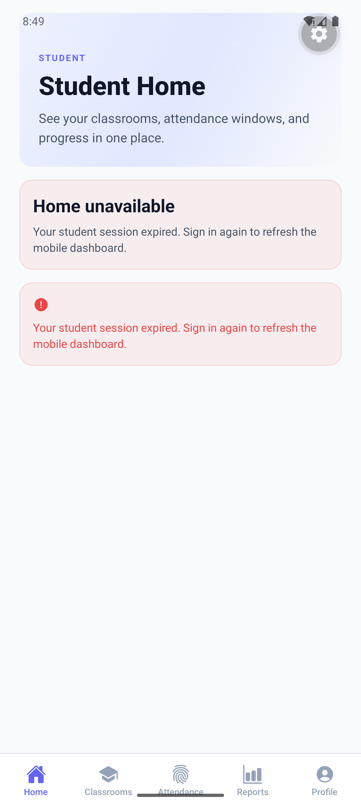

<p align="center">
  
</p>

<h1 align="center">AttendEase</h1>

<p align="center">
  <strong>Smart Attendance Management Platform</strong><br/>
  Bluetooth beacons, rolling QR codes, GPS verification — all in one system.
</p>

<p align="center">
  <a href="#features">Features</a> •
  <a href="#tech-stack">Tech Stack</a> •
  <a href="#architecture">Architecture</a> •
  <a href="#getting-started">Getting Started</a> •
  <a href="#project-structure">Project Structure</a> •
  <a href="#deployment">Deployment</a> •
  <a href="#testing">Testing</a>
</p>

---

## Overview

AttendEase is a full-stack attendance management system designed for universities and institutions. It combines **three attendance verification methods** — Bluetooth Low Energy (BLE) beacons, rolling QR codes, and GPS geofencing — into a unified platform with real-time tracking, analytics, and administrative controls.

The system consists of a **mobile app** (shared by students and teachers), a **web dashboard** (for teachers and admins), a **REST API**, and a **background worker** — all built as a TypeScript monorepo.

---

## Features

### For Students
- **One-tap attendance** via Bluetooth proximity or QR code scanning
- **GPS-verified check-ins** with configurable geofencing
- **Real-time dashboard** showing attendance stats, upcoming classes, and alerts
- **Classroom enrollment** via join codes
- **Attendance history** with per-subject breakdowns and visual reports
- **Device binding** — one student, one trusted device

### For Teachers
- **Bluetooth attendance sessions** — broadcast from the teacher's phone, students mark automatically
- **QR code attendance** — rolling codes projected on screen, expire every few seconds
- **Session management** — start, monitor live roster, end, and review
- **Manual corrections** — edit individual attendance records post-session
- **Classroom management** — create courses, manage rosters, schedule lectures
- **Reports & exports** — attendance analytics with CSV/PDF export
- **Announcements** — post updates to classroom streams

### For Admins
- **Device governance** — trust, revoke, and recover student devices
- **Student and classroom oversight** — full visibility across the institution
- **Audit trails** — all actions logged with timestamps

### Platform Highlights
- **Multi-mode attendance** — BLE, QR+GPS, or manual; per-session configurable
- **Real-time sync** — live attendance counts during active sessions
- **Role-based access** — Student, Teacher, Admin with scoped permissions
- **Academic structure** — semesters, classes, sections, subjects, and teacher assignments
- **Dark mode** — full theme support across web and mobile

---

## Tech Stack

| Layer | Technology |
|-------|-----------|
| **API** | [NestJS](https://nestjs.com/) 11 on [Fastify](https://fastify.dev/) |
| **Web** | [Next.js](https://nextjs.org/) 16 (App Router, SSR) |
| **Mobile** | [Expo](https://expo.dev/) 55 + [React Native](https://reactnative.dev/) 0.83 |
| **Database** | PostgreSQL ([Neon](https://neon.tech/) serverless) + [Prisma](https://www.prisma.io/) ORM |
| **Worker** | [BullMQ](https://bullmq.io/) job processing |
| **Auth** | JWT (access + refresh tokens), Google OIDC |
| **Bluetooth** | Custom BLE advertising/scanning via native Android module |
| **Monorepo** | [pnpm](https://pnpm.io/) workspaces + [Turborepo](https://turbo.build/) |
| **Linting** | [Biome](https://biomejs.dev/) |
| **Testing** | [Vitest](https://vitest.dev/) (unit + integration) |
| **CI/CD** | GitHub Actions (lint, typecheck, test, build, Docker) |
| **Deployment** | Netlify (web), Render (API via Docker), Neon (database) |

---

## Architecture

```
┌─────────────┐    ┌─────────────┐    ┌─────────────────┐    ┌──────────────┐
│   Mobile     │    │   Web App   │    │  Background      │    │              │
│  (Expo/RN)   │    │  (Next.js)  │    │  Worker          │    │  PostgreSQL  │
│             │    │             │    │  (BullMQ)        │    │  (Neon)      │
│  Student +   │    │  Teacher +   │    │                 │    │              │
│  Teacher     │    │  Admin       │    │  Email, exports, │    │  Prisma ORM  │
│  shared app  │    │  dashboard   │    │  notifications   │    │              │
└──────┬───────┘    └──────┬───────┘    └────────┬─────────┘    └──────▲───────┘
       │                   │                     │                     │
       │         HTTPS     │          HTTPS      │                     │
       └───────────────────┴─────────────────────┴─────────────────────┘
                                     │
                            ┌────────▼────────┐
                            │   REST API       │
                            │   (NestJS +      │
                            │    Fastify)      │
                            │                 │
                            │  Auth, RBAC,    │
                            │  BLE tokens,    │
                            │  QR rotation    │
                            └─────────────────┘
```

### Shared Packages

The monorepo shares code across all apps through internal packages:

| Package | Purpose |
|---------|---------|
| `@attendease/contracts` | Zod schemas for API request/response validation |
| `@attendease/db` | Prisma schema, client, migrations, seed scripts |
| `@attendease/auth` | JWT utilities, token generation, guards |
| `@attendease/config` | Shared environment configuration |
| `@attendease/domain` | Core business logic and domain models |
| `@attendease/email` | Email templates and sending |
| `@attendease/export` | CSV/PDF export utilities |
| `@attendease/notifications` | Push notification service |
| `@attendease/realtime` | WebSocket/SSE real-time events |
| `@attendease/ui-mobile` | Shared React Native components and theme |
| `@attendease/ui-web` | Shared web UI components |
| `@attendease/utils` | Common utilities and helpers |

---

## Getting Started

### Prerequisites

- **Node.js** >= 22.12.0
- **pnpm** >= 9.x
- **Docker** (for local PostgreSQL, or use Neon)
- **Android Studio** (for mobile development)

### Installation

```bash
# Clone the repository
git clone https://github.com/Kanan2005/attendease-web-app-deployed.git
cd attendease-web-app-deployed

# Install dependencies
pnpm install

# Copy environment variables
cp .env.example .env
# Edit .env with your database URL, JWT secrets, etc.
```

### Local Development

```bash
# Start PostgreSQL (Docker)
docker compose up -d

# Run database migrations
pnpm --filter @attendease/db prisma migrate deploy

# Seed the database
pnpm --filter @attendease/db seed

# Start all services in parallel
pnpm turbo dev
```

This starts:
- **API** at `http://localhost:4000`
- **Web** at `http://localhost:3000`
- **Mobile** via Expo DevTools

### Individual Services

```bash
# API only
pnpm --filter @attendease/api dev

# Web only
pnpm --filter @attendease/web dev

# Mobile only
pnpm --filter @attendease/mobile dev

# Worker only
pnpm --filter @attendease/worker dev
```

---

## Project Structure

```
attendease-web-app-deployed/
├── apps/
│   ├── api/                    # NestJS REST API
│   │   ├── src/modules/        #   Feature modules (auth, attendance, academic, etc.)
│   │   ├── src/test/           #   Integration & e2e tests
│   │   └── Dockerfile          #   Production Docker image
│   ├── web/                    # Next.js teacher/admin dashboard
│   │   ├── app/                #   App Router pages and layouts
│   │   ├── src/                #   Client components and workflows
│   │   └── Dockerfile          #   Production Docker image
│   ├── mobile/                 # Expo + React Native app (student & teacher)
│   │   ├── app/                #   Expo Router screens
│   │   ├── src/                #   Feature screens and hooks
│   │   └── modules/            #   Native BLE module (Android)
│   └── worker/                 # BullMQ background jobs
│       └── src/jobs/           #   Email, export, notification jobs
├── packages/                   # Shared internal packages
│   ├── contracts/              #   Zod API schemas
│   ├── db/                     #   Prisma schema + migrations
│   ├── auth/                   #   JWT + guards
│   ├── config/                 #   Environment config
│   ├── domain/                 #   Business logic
│   └── ...                     #   (email, export, ui-mobile, ui-web, utils, etc.)
├── docs/                       # Documentation
│   ├── architecture/           #   System design documents
│   ├── requirements/           #   Product requirements
│   ├── guides/                 #   Developer guides and runbooks
│   ├── planning/               #   Release plans and test strategies
│   ├── prompts/                #   Implementation prompt history
│   └── screenshots/            #   App screenshots (web, mobile, audits)
├── scripts/                    # Build and validation scripts
├── .github/workflows/          # CI/CD pipelines
├── docker-compose.yml          # Local development stack
├── docker-compose.runtime.yml  # Production-like runtime
├── render.yaml                 # Render deployment blueprint
├── turbo.json                  # Turborepo pipeline config
├── biome.json                  # Linter/formatter config
└── pnpm-workspace.yaml         # Monorepo workspace definition
```

---

## Testing

```bash
# Run all tests
pnpm turbo test

# Run API tests (222 integration tests)
pnpm --filter @attendease/api test

# Run with coverage
pnpm --filter @attendease/api test -- --coverage

# Lint all packages
pnpm turbo lint

# Type-check all packages
pnpm turbo typecheck
```

### CI Pipeline

Every push runs 6 automated checks via GitHub Actions:

| Check | What it does |
|-------|-------------|
| **Lint** | Biome formatting and lint rules across all packages |
| **Typecheck** | TypeScript strict mode compilation |
| **Test** | Vitest unit and integration tests with temp PostgreSQL |
| **Build** | Full production build of API, Web, and Worker |
| **Workspace Validate** | Monorepo integrity, file size limits |
| **Docker Runtime** | Builds and validates Docker images |

---

## Deployment

### Production URLs

| Service | URL | Platform |
|---------|-----|----------|
| Web App | [attendease-anurag.netlify.app](https://attendease-anurag.netlify.app) | Netlify |
| API | [attendease-api-4h45.onrender.com](https://attendease-api-4h45.onrender.com) | Render |
| Database | Neon PostgreSQL (ap-southeast-1) | Neon |

### Deploy Web (Netlify)

```bash
pnpm turbo build --filter=@attendease/web --force
netlify deploy --prod
```

### Deploy API (Render)

Automatic on push to `main` via `render.yaml` blueprint. The API runs as a Docker container on Render's free tier.

> **Note:** Render free tier spins down after 15 min of inactivity. First request after sleep takes ~30-60s (cold start).

### Build Mobile APK

```bash
cd apps/mobile/android
./gradlew assembleRelease --no-daemon
# Output: app/build/outputs/apk/release/app-release.apk
```

---

## Environment Variables

Copy `.env.example` and configure:

| Variable | Description |
|----------|-------------|
| `DATABASE_URL` | PostgreSQL connection string |
| `JWT_SECRET` | Secret for signing access tokens |
| `JWT_REFRESH_SECRET` | Secret for signing refresh tokens |
| `GOOGLE_OIDC_CLIENT_ID` | Google OAuth client ID |
| `NEXT_PUBLIC_API_URL` | API URL for the web frontend |
| `EXPO_PUBLIC_API_URL` | API URL for the mobile app |

See `.env.example` for the full list.

---

## Documentation

Detailed documentation lives in the [`docs/`](docs/) directory:

| Directory | Contents |
|-----------|---------|
| [`docs/architecture/`](docs/architecture/) | System design, codebase structure, tech stack details |
| [`docs/requirements/`](docs/requirements/) | Product requirements for all 12 feature areas |
| [`docs/guides/`](docs/guides/) | Developer guides, runbooks, troubleshooting |
| [`docs/planning/`](docs/planning/) | Release checklists, test strategies, validation reports |
| [`docs/screenshots/`](docs/screenshots/) | App screenshots across web and mobile |

---

## License

This project is for educational purposes.
