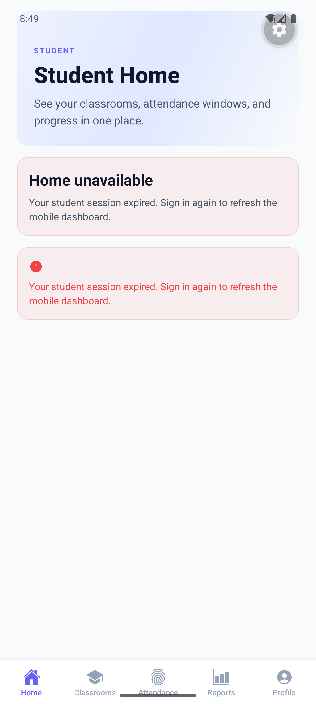
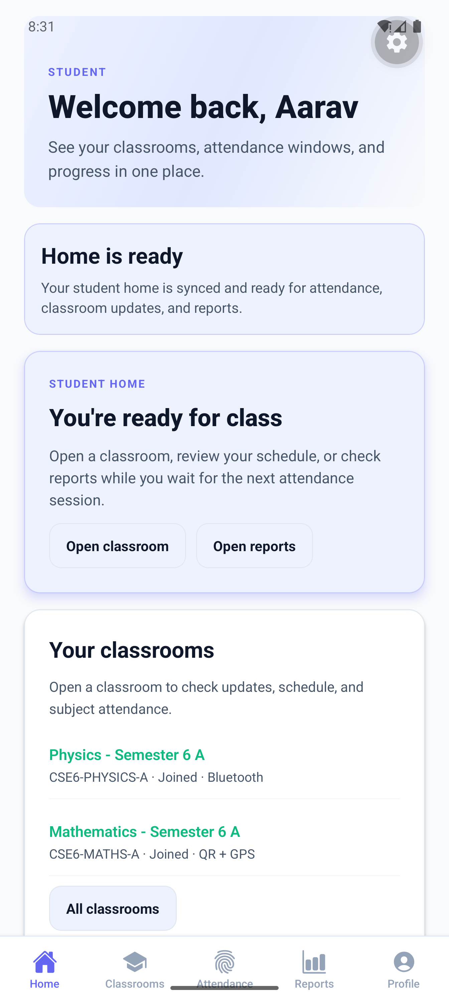
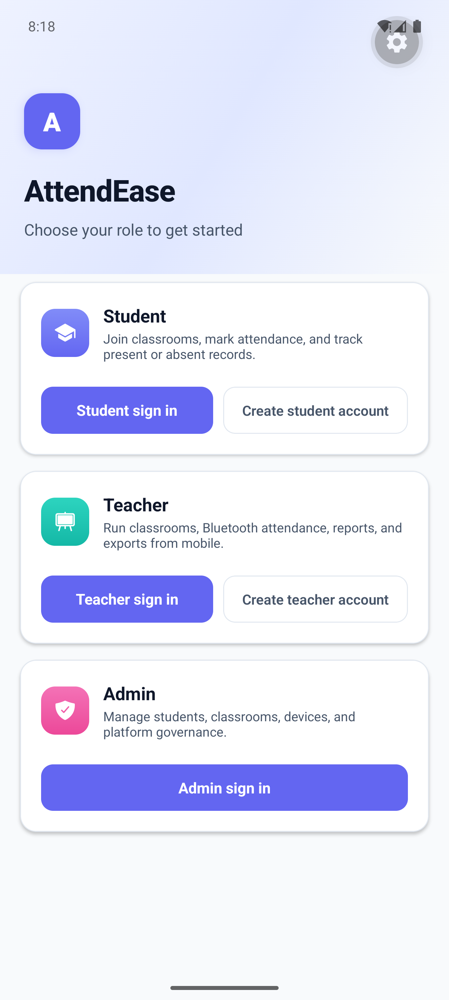
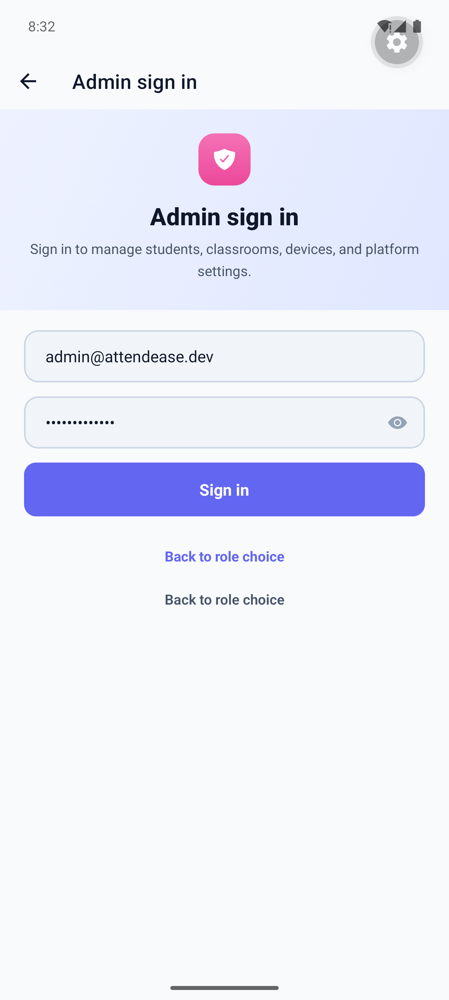

<div align="center">



# AttendEase

**Smart Attendance Management for Modern Institutions**

Bluetooth beacons | Rolling QR codes | GPS geofencing | Real-time analytics

[](https://github.com/Kanan2005/attendease-web-app-deployed/actions/workflows/build.yml)
[](https://github.com/Kanan2005/attendease-web-app-deployed/actions/workflows/lint.yml)
[](https://github.com/Kanan2005/attendease-web-app-deployed/actions/workflows/test.yml)
[](https://www.typescriptlang.org/)
[](https://nextjs.org/)
[](https://nestjs.com/)
[](https://expo.dev/)
[](https://neon.tech/)

[Live Demo](https://attendeaselive.xyz) &nbsp;&bull;&nbsp; [API Docs](#api-endpoints) &nbsp;&bull;&nbsp; [Screenshots](#screenshots) &nbsp;&bull;&nbsp; [Get Started](#getting-started)

</div>

---

## What is AttendEase?

AttendEase is a production-grade, full-stack attendance management platform built for universities and educational institutions. It replaces manual roll calls with **three automated verification methods** — Bluetooth Low Energy (BLE) proximity, rolling QR codes, and GPS geofencing — all working together in a single unified system.

The platform serves three user roles through dedicated interfaces:

| Role | Interface | Key Capabilities |
|------|-----------|-----------------|
| **Students** | Mobile app (Android) | Mark attendance via BLE/QR/GPS, view stats, join classrooms |
| **Teachers** | Mobile app + Web dashboard | Start sessions, monitor live rosters, grade attendance, export reports |
| **Admins** | Web dashboard | Manage users, devices, settings, communications, institution-wide analytics |

> Built as a **TypeScript monorepo** with 4 apps, 12 shared packages, 44 database models, 100+ test files, and a full CI/CD pipeline.

---

## Key Features

### Attendance Modes

| Mode | How it Works | Anti-spoofing |
|------|-------------|---------------|
| **Bluetooth (BLE)** | Teacher's phone broadcasts a rotating beacon; students within range auto-mark | Device binding + proximity verification |
| **QR Code** | Rolling QR codes refresh every 2s on projector; students scan with phone camera | Time-limited tokens + GPS cross-check |
| **GPS Geofencing** | Verify student's location is within configurable radius of classroom | Configurable radius (default 100m) |
| **Manual** | Teacher manually marks students from the roster | Audit-logged with editor tracking |

### Student Experience
- **One-tap check-in** — BLE attendance happens automatically in the background
- **QR scanner** — built-in camera scanner with instant feedback
- **Personal dashboard** — attendance percentage, subject-wise breakdown, alerts
- **Classroom enrollment** — join via 6-digit codes shared by teachers
- **Device trust** — one student, one verified device (admin-managed)

### Teacher Experience
- **Live attendance sessions** — start BLE or QR sessions with one tap
- **Real-time roster** — watch students mark attendance live with present/absent counters
- **Projector mode** — full-screen QR display optimized for classroom projection
- **Post-session editing** — correct individual records with audit trail
- **Classroom management** — create courses, schedule lectures, manage enrollments
- **Reports & CSV export** — download attendance data filtered by date range, subject, or student

### Admin Dashboard
- **Institution analytics** — enrollment stats, attendance trends, session heatmaps
- **User management** — search, filter, and manage all students and teachers
- **Device governance** — trust, revoke, or recover student device bindings
- **Communication tools** — email filtered student groups directly via Gmail integration
- **System settings** — configure GPS radius, QR rotation interval, attendance thresholds
- **Report generation** — export institution-wide CSV reports

---

## Tech Stack

<table>
<tr>
<td width="140"><strong>Frontend (Web)</strong></td>
<td>Next.js 16 &bull; React 19 &bull; App Router &bull; SSR &bull; CSS-in-JS with custom theme system</td>
</tr>
<tr>
<td><strong>Frontend (Mobile)</strong></td>
<td>Expo 55 &bull; React Native 0.83 &bull; Expo Router &bull; Custom native BLE module (Android)</td>
</tr>
<tr>
<td><strong>Backend API</strong></td>
<td>NestJS 11 &bull; Fastify &bull; JWT auth (access + refresh tokens) &bull; Role-based guards</td>
</tr>
<tr>
<td><strong>Database</strong></td>
<td>PostgreSQL on Neon (serverless) &bull; Prisma ORM &bull; 44 models &bull; 19 migrations</td>
</tr>
<tr>
<td><strong>Background Jobs</strong></td>
<td>BullMQ worker &bull; Email dispatch &bull; CSV/PDF export &bull; Analytics aggregation</td>
</tr>
<tr>
<td><strong>Auth</strong></td>
<td>JWT access/refresh tokens &bull; Google OIDC &bull; Device binding &bull; Session management</td>
</tr>
<tr>
<td><strong>Monorepo</strong></td>
<td>pnpm workspaces &bull; Turborepo &bull; 12 shared internal packages</td>
</tr>
<tr>
<td><strong>Quality</strong></td>
<td>Biome (lint + format) &bull; Vitest (100+ test files) &bull; TypeScript strict mode</td>
</tr>
<tr>
<td><strong>CI/CD</strong></td>
<td>GitHub Actions (7 workflows) &bull; Docker builds &bull; Automated deployment</td>
</tr>
<tr>
<td><strong>Deployment</strong></td>
<td>Netlify (web) &bull; Render (API via Docker) &bull; Neon (database) &bull; Custom domain</td>
</tr>
</table>

---

## Architecture

```
                    ┌──────────────────────────────────────────────┐
                    │              Client Applications             │
                    ├──────────────┬───────────────┬───────────────┤
                    │  Mobile App  │   Web Portal  │  Admin Panel  │
                    │  (Expo/RN)   │  (Next.js)    │  (Next.js)    │
                    │              │               │               │
                    │  Students &  │  Teacher      │  Institution  │
                    │  Teachers    │  Dashboard    │  Management   │
                    └──────┬───────┴───────┬───────┴───────┬───────┘
                           │               │               │
                           │          HTTPS / JWT          │
                           └───────────────┼───────────────┘
                                           │
                    ┌──────────────────────▼──────────────────────┐
                    │              REST API (NestJS)              │
                    │                                             │
                    │  Auth & Sessions  │  Attendance Engine      │
                    │  Academic CRUD    │  BLE Token Rotation     │
                    │  QR Code Gen      │  GPS Verification       │
                    │  Export Pipeline  │  Device Governance      │
                    └──────────┬───────────────────┬─────────────┘
                               │                   │
                    ┌──────────▼──────┐  ┌─────────▼──────────┐
                    │   PostgreSQL    │  │  Background Worker  │
                    │   (Neon)        │  │  (BullMQ)           │
                    │                 │  │                     │
                    │  44 models      │  │  Emails, exports,   │
                    │  Prisma ORM     │  │  analytics jobs     │
                    └─────────────────┘  └─────────────────────┘
```

### Shared Package Ecosystem

All apps share code through 12 internal packages, ensuring type-safety across the entire stack:

```
packages/
├── contracts/     # Zod schemas — single source of truth for API types
├── db/            # Prisma schema, migrations, client, seed scripts
├── auth/          # JWT generation, verification, API client
├── config/        # Environment variable loading & validation
├── domain/        # Core business logic and domain models
├── email/         # Email templates and transport
├── export/        # CSV/PDF generation utilities
├── notifications/ # Push notification service
├── realtime/      # WebSocket/SSE event system
├── ui-mobile/     # Shared React Native components & theme
├── ui-web/        # Shared web UI components & theme
└── utils/         # Common helpers and utilities
```

---

## Screenshots

<table>
<tr>
<td width="50%" align="center">
<strong>Student Mobile — Dashboard</strong><br/>

</td>
<td width="50%" align="center">
<strong>Teacher Web — Live QR Session</strong><br/>

</td>
</tr>
<tr>
<td align="center">
<strong>Login — Unified Sign-in</strong><br/>

</td>
<td align="center">
<strong>Admin — Dashboard</strong><br/>

</td>
</tr>
</table>

> More screenshots available in [`docs/screenshots/`](docs/screenshots/)

---

## Getting Started

### Prerequisites

| Tool | Version | Purpose |
|------|---------|---------|
| Node.js | >= 22.12.0 | Runtime |
| pnpm | >= 9.x | Package manager |
| Docker | Latest | Local PostgreSQL + Redis |
| Android Studio | Latest | Mobile development (optional) |

### Quick Start

```bash
# 1. Clone the repo
git clone https://github.com/Kanan2005/attendease-web-app-deployed.git
cd attendease-web-app-deployed

# 2. Install dependencies
pnpm install

# 3. Start infrastructure (PostgreSQL + Redis)
docker compose up -d

# 4. Setup environment files
cp apps/api/.env.example apps/api/.env.local
cp apps/web/.env.example apps/web/.env.local
cp apps/mobile/.env.example apps/mobile/.env.local

# 5. Run database migrations and seed
pnpm --filter @attendease/db prisma migrate deploy
pnpm --filter @attendease/db seed

# 6. Start everything
pnpm turbo dev
```

This launches:

| Service | URL | Description |
|---------|-----|-------------|
| API | `http://localhost:4000` | REST API with Swagger docs |
| Web | `http://localhost:3000` | Teacher & Admin dashboard |
| Mobile | Expo DevTools | Student & Teacher mobile app |

### Run Individual Apps

```bash
pnpm --filter @attendease/api dev      # API only
pnpm --filter @attendease/web dev      # Web only
pnpm --filter @attendease/mobile dev   # Mobile only
pnpm --filter @attendease/worker dev   # Background worker only
```

---

## Project Structure

```
attendease/
│
├── apps/
│   ├── api/                        # NestJS REST API
│   │   ├── src/modules/            #   Feature modules (auth, attendance, academic, admin, etc.)
│   │   ├── src/test/               #   Integration & e2e tests
│   │   └── Dockerfile              #   Production Docker image
│   │
│   ├── web/                        # Next.js web dashboard
│   │   ├── app/                    #   App Router — pages, layouts, route handlers
│   │   ├── src/                    #   Client components, workflows, hooks
│   │   └── netlify.toml            #   Deployment config
│   │
│   ├── mobile/                     # Expo + React Native mobile app
│   │   ├── app/                    #   Expo Router screens
│   │   ├── src/                    #   Feature screens, hooks, state
│   │   └── modules/                #   Native BLE module (Kotlin/Android)
│   │
│   └── worker/                     # BullMQ background job processor
│       └── src/jobs/               #   Email, export, analytics jobs
│
├── packages/                       # 12 shared internal packages
│   ├── contracts/                  #   Zod schemas (single source of truth)
│   ├── db/                         #   Prisma schema (44 models) + migrations
│   ├── auth/                       #   JWT utilities + API client
│   ├── config/                     #   Env validation (Zod-based)
│   └── ...                         #   domain, email, export, ui-mobile, ui-web, utils
│
├── docs/                           # Comprehensive documentation
│   ├── architecture/               #   System design & tech stack
│   ├── requirements/               #   Product requirements (12 feature areas)
│   ├── guides/                     #   Developer guides & runbooks
│   └── screenshots/                #   App screenshots
│
├── .github/workflows/              # 7 CI/CD pipelines
├── docker-compose.yml              # Local dev stack
├── docker-compose.runtime.yml      # Production-like runtime
├── render.yaml                     # Render deployment blueprint
├── turbo.json                      # Turborepo pipeline config
└── biome.json                      # Linter + formatter config
```

---

## Database Schema

The database contains **44 models** across these domains:

| Domain | Models | Description |
|--------|--------|-------------|
| **Identity** | User, UserCredential, UserRole, OAuthAccount, StudentProfile, TeacherProfile | Multi-role user system with device binding |
| **Auth** | AuthSession, RefreshToken, LoginEvent | JWT session management with audit trail |
| **Academic** | AcademicTerm, Semester, AcademicClass, Section, Subject, TeacherAssignment | Full academic structure |
| **Courses** | CourseOffering, Enrollment, CourseScheduleSlot, CourseScheduleException, Lecture | Course management with scheduling |
| **Attendance** | AttendanceSession, AttendanceRecord, AttendanceEvent, AttendanceEditAuditLog | Multi-mode attendance with edit history |
| **Communication** | AnnouncementPost, AnnouncementReceipt, EmailAutomationRule, EmailDispatchRun, EmailLog | Announcements and email automation |
| **Analytics** | AnalyticsDailyAttendance, AnalyticsSubjectAttendance, AnalyticsStudentCourseSummary | Pre-aggregated analytics |
| **Security** | Device, UserDeviceBinding, SecurityEvent, AdminActionLog | Device governance and audit logging |
| **System** | ExportJob, ExportJobFile, RosterImportJob, OutboxEvent, SystemSetting | Background jobs and system config |

---

## Testing

```bash
# Run the full test suite
pnpm turbo test

# API integration tests
pnpm --filter @attendease/api test

# Run with coverage report
pnpm --filter @attendease/api test -- --coverage

# Lint all packages (Biome)
pnpm turbo lint

# Type-check everything (strict mode)
pnpm turbo typecheck
```

### CI/CD Pipeline

Every push triggers **7 automated workflows** via GitHub Actions:

| Workflow | What it Checks |
|----------|---------------|
| **Lint** | Biome formatting and lint rules across all packages |
| **Typecheck** | TypeScript strict-mode compilation for every app and package |
| **Test** | Vitest unit + integration tests with ephemeral PostgreSQL |
| **Build** | Full production build of API, Web, and Worker |
| **Workspace Validate** | Monorepo integrity, dependency checks, file size limits |
| **Docker** | Builds and validates production Docker images |
| **Keep-alive** | Prevents Render free-tier cold starts |

---

## Deployment

### Production Environment

| Service | URL | Platform |
|---------|-----|----------|
| **Web App** | [attendeaselive.xyz](https://attendeaselive.xyz) | Netlify |
| **REST API** | [attendease-api-4h45.onrender.com](https://attendease-api-4h45.onrender.com) | Render (Docker) |
| **Database** | Neon PostgreSQL (ap-southeast-1) | Neon Serverless |
| **Mobile APK** | Direct download | Android |

### Deploy Commands

```bash
# Web — auto-deploys on push to main (Netlify)
git push origin main

# API — auto-deploys on push to main (Render)
# Uses render.yaml blueprint with Docker

# Mobile APK — manual build
cd apps/mobile/android
./gradlew assembleRelease --no-daemon
# Output: app/build/outputs/apk/release/app-release.apk (~110MB)
```

> **Note:** The API runs on Render's free tier, which spins down after 15 minutes of inactivity. The first request after a cold start takes ~30-60 seconds. A keep-alive workflow mitigates this.

---

## Environment Variables

<details>
<summary><strong>Click to expand full environment variable reference</strong></summary>

### Web App (`apps/web/.env.local`)

| Variable | Description |
|----------|-------------|
| `NEXT_PUBLIC_APP_URL` | Public web app URL |
| `NEXT_PUBLIC_API_URL` | REST API URL |
| `WEB_INTERNAL_API_URL` | Internal API URL (server-side) |
| `NEXT_PUBLIC_APP_ENV` | `development` or `production` |
| `NEXT_PUBLIC_GOOGLE_OIDC_CLIENT_ID` | Google OAuth client ID |

### API (`apps/api/.env.local`)

| Variable | Description |
|----------|-------------|
| `DATABASE_URL` | PostgreSQL connection string |
| `REDIS_URL` | Redis connection string |
| `AUTH_ACCESS_TOKEN_SECRET` | JWT access token secret |
| `AUTH_REFRESH_TOKEN_SECRET` | JWT refresh token secret |
| `API_CORS_ALLOWED_ORIGINS` | Comma-separated allowed origins |
| `STORAGE_ENDPOINT` | S3-compatible storage endpoint |
| `EMAIL_PROVIDER_MODE` | `console`, `ses`, or `smtp` |

### Mobile (`apps/mobile/.env.local`)

| Variable | Description |
|----------|-------------|
| `EXPO_PUBLIC_API_URL` | REST API URL |
| `EXPO_PUBLIC_APP_ENV` | `development` or `production` |

</details>

---

## Documentation

Comprehensive documentation is maintained in the [`docs/`](docs/) directory:

| Directory | What's Inside |
|-----------|--------------|
| [`architecture/`](docs/architecture/) | System design, data models, API contracts, tech decisions |
| [`requirements/`](docs/requirements/) | Product requirements for all 12 feature areas |
| [`guides/`](docs/guides/) | Developer setup, deployment runbooks, troubleshooting |
| [`planning/`](docs/planning/) | Release checklists, test strategies, validation reports |
| [`screenshots/`](docs/screenshots/) | App screenshots across web, mobile, and admin |

---

## Contributing

1. Fork the repository
2. Create a feature branch (`git checkout -b feature/amazing-feature`)
3. Commit your changes (`git commit -m 'feat: add amazing feature'`)
4. Push to the branch (`git push origin feature/amazing-feature`)
5. Open a Pull Request

Please ensure your PR passes all CI checks (lint, typecheck, test, build).

---

## License

This project was built for educational and demonstration purposes as part of academic coursework.

---

<div align="center">

**Built with** &nbsp; TypeScript &bull; Next.js &bull; NestJS &bull; Expo &bull; PostgreSQL &bull; Prisma

**Deployed on** &nbsp; Netlify &bull; Render &bull; Neon

</div>
