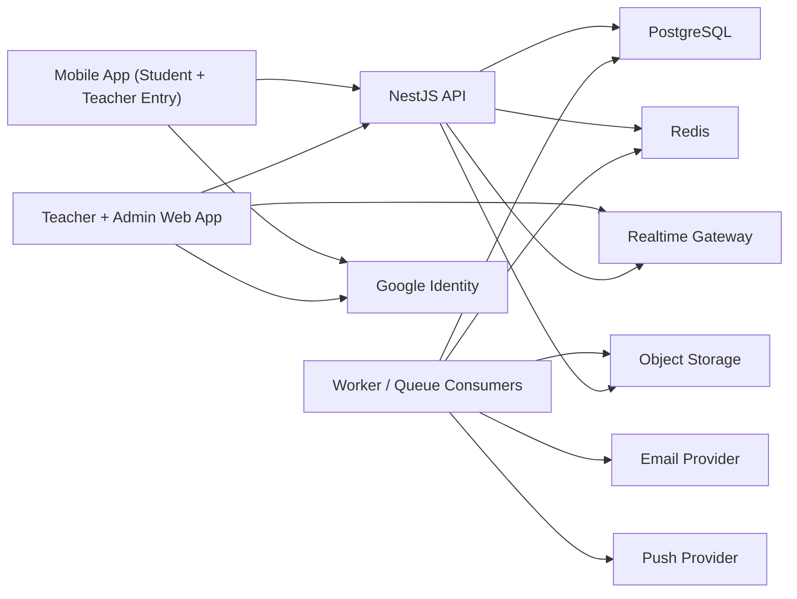

# System Overview Architecture
Maps to: [`../requirements/01-system-overview.md`](../requirements/01-system-overview.md)

## Purpose

This document defines the top-level AttendEase architecture across mobile, web, backend, storage, realtime, and background jobs.

## Reset Implementation Snapshot

The reset-track architecture described here is now represented in the repo rather than remaining a planning-only target.

- one shared mobile runtime now hosts distinct student and teacher route trees
- teacher/admin web is now role-separated at the route and auth-entry level
- backend, worker, reporting, export, and governance flows are already wired to the reset UX
- remaining work is release validation and final product-story verification, not runtime restructuring

## Architectural Decision Summary

AttendEase will be implemented as a TypeScript monorepo with four runtime applications:

- `apps/mobile` for iOS and Android
- `apps/web` for the teacher and admin web portal
- `apps/api` for the shared backend API
- `apps/worker` for asynchronous and scheduled work

This split is intentional. The product has three different interaction styles:

- mobile foreground attendance flows with camera, GPS, and BLE
- browser dashboard, projector, and admin-management flows
- background export, analytics, email, import, and notification processing

Trying to put all of that inside a single web app would make Bluetooth, scheduling, and operational reliability harder.

## Reset Baseline Constraints

The reset track keeps the current approved stack, but it clarifies product boundaries:

- one shared mobile binary with separate student and teacher entry/auth/navigation
- teacher onboarding uses registration plus sign-in on mobile and web
- teacher mobile is the Bluetooth attendance-session owner
- teacher web is the QR + GPS attendance-session owner
- student onboarding must support self-registration with one-device binding
- admin remains a separately provisioned login-only web role with recovery and governance powers

These constraints must shape later UX and IA work without undoing the existing backend/domain foundations.

## High-Level Runtime Architecture



## Why This Architecture Fits AttendEase

### Shared Backend

Both mobile and web must obey the same attendance rules. Session lifecycle, eligibility, duplicate prevention, edit windows, percentage calculations, and export data must come from the same backend services.

### Role-Separated Product Surfaces

The current repo already has separate route groups, but the reset track requires a stronger product split:

- student mobile: registration, classroom participation, attendance, history, and self-reporting
- teacher mobile: Bluetooth attendance plus supporting classroom operations
- teacher web: QR + GPS attendance, reporting, exports, analytics, and automation
- admin web: recovery, governance, device support, and cross-classroom operations

This is a product-layer separation, not a new runtime split.

### Separate Worker

Exports, email sends, and analytics refresh are all better handled asynchronously. This avoids blocking live attendance traffic while heavy tasks run.

### Realtime Gateway

Teacher QR sessions need live marked-count updates and rolling QR refresh. A realtime layer makes the classroom projector workflow smooth.

## Monorepo Package Boundaries

The codebase should be organized around clear ownership boundaries.

```text
apps/api/src/modules/
  auth/
  academic/
  classrooms/
  scheduling/
  announcements/
  devices/
  admin/
  sessions/
  attendance/
  qr/
  bluetooth/
  history/
  reports/
  exports/
  analytics/
  automation/
  audit/
  realtime/

apps/mobile/src/
  app/
  features/
  services/
  store/
  hooks/
  components/
  native/

apps/web/src/
  app/
  features/
  components/
  lib/

packages/
  auth/
  config/
  contracts/
  db/
  domain/
  email/
  export/
  notifications/
  realtime/
  ui-mobile/
  ui-web/
  utils/
```

## Foundation Notes

The original scaffold baseline, runtime conventions, and rollout sequence now live in
[`./01-system-overview-foundation.md`](./01-system-overview-foundation.md) so this main
architecture doc can stay focused on runtime boundaries and domain ownership.

## Major Domain Modules

### Academic Module

Owns:

- semesters and academic terms
- class and section masters
- subjects
- course offerings / classrooms
- teacher assignments
- student enrollments

### Classroom Module

Owns:

- teacher classroom creation
- join code generation
- roster membership
- classroom detail view

### Scheduling Module

Owns:

- weekly schedule slots
- one-off extra classes
- reschedules and cancellations
- lecture plan generation

### Announcements Module

Owns:

- classroom stream posts
- save-and-notify flows
- in-app notifications
- optional email or push fan-out

### Sessions Module

Owns:

- session creation
- session state transitions
- session roster snapshot creation
- session end and finalization

### Attendance Module

Owns:

- student mark-attendance actions
- duplicate prevention
- final session attendance state
- manual edits

### QR Module

Owns:

- rolling QR token generation
- QR validation rules
- projector payload generation

### Bluetooth Module

Owns:

- BLE rotating identifier generation
- session advertisement verification
- BLE mark-attendance verification

### Devices and Security Module

Owns:

- trusted device registration
- device-to-student binding
- anti-account-switch enforcement for attendance
- suspicious event logging

### Admin Module

Owns:

- device delink and recovery flows
- semester lifecycle administration
- course and roster support operations
- import monitoring and support actions

### Reports and Analytics Modules

Own:

- report read models
- export data shaping
- aggregate refresh pipelines
- teacher dashboard metrics

### Automation Module

Owns:

- low-attendance rules
- daily schedule execution
- email run logging

## Shared Data Flow Pattern

Most important product actions will use the same pattern:

1. Client sends request with authenticated user context.
2. API validates role, input schema, and domain permissions.
3. Service runs a transaction against PostgreSQL.
4. Service writes an outbox event when downstream work is required.
5. API returns the authoritative result to the client.
6. Worker consumes the outbox event for aggregates, emails, notifications, imports, or exports.
7. Realtime gateway publishes any live UI updates.

This pattern avoids hidden data drift between live features and background tasks.

## Session Lifecycle Standard

All attendance modes should follow a common lifecycle:

- `DRAFT` before activation if a config screen exists
- `ACTIVE` when attendance can be marked
- `ENDED` when no new marks are allowed
- `EDITABLE` as a derived state while inside the 24-hour edit window
- `LOCKED` as a derived state after the edit window closes

The database will store canonical timestamps such as:

- `started_at`
- `ended_at`
- `editable_until`

Derived states in code should be based on these timestamps instead of being manually edited in many places.

## Realtime Strategy

Realtime is needed for two specific cases:

- teacher projector live marked count and session status
- optional teacher-mobile live count during Bluetooth sessions
- announcement and classroom change refresh on active course detail pages

Implementation:

- Socket.IO gateway in `apps/api`
- Redis adapter for scaling across API instances
- event channels keyed by `session:{sessionId}`

Event types:

- `session.updated`
- `session.counter.updated`
- `session.qr.rotated`
- `session.ended`

## Storage Strategy

### PostgreSQL

Stores:

- user and academic records
- course schedules
- join codes and roster imports
- sessions
- attendance records
- device bindings and security events
- audit logs
- analytics aggregate tables
- export jobs
- email rules and logs

### Redis

Stores:

- BullMQ queues
- short-lived session cache
- websocket pub/sub
- rate-limit counters

### Object Storage

Stores:

- generated PDF files
- generated CSV files
- classroom import files
- optional announcement attachments

Exports should not be kept only on the API filesystem because multiple instances and redeploys would lose them.

## Deployment Shape

### Web

- deploy as Next.js app
- optimized for SSR and dashboard routes

### API

- deploy as stateless container(s)
- scale horizontally during attendance peaks

### Worker

- deploy as one or more queue workers
- scale independently from API

### Data Services

- managed PostgreSQL
- managed Redis
- S3-compatible storage

## Cross-Cutting Technical Standards

- TypeScript everywhere
- Zod schemas at API boundaries
- Prisma for schema and migrations
- TanStack Query for server-state in web and mobile
- Google OIDC for supported login paths
- platform attestation for trusted-device workflows
- structured logs with request and session IDs
- strict unique constraints for attendance integrity
- append-only audit trail for edits and sends

Implementation sequencing is also tracked in
[`./01-system-overview-foundation.md`](./01-system-overview-foundation.md).
